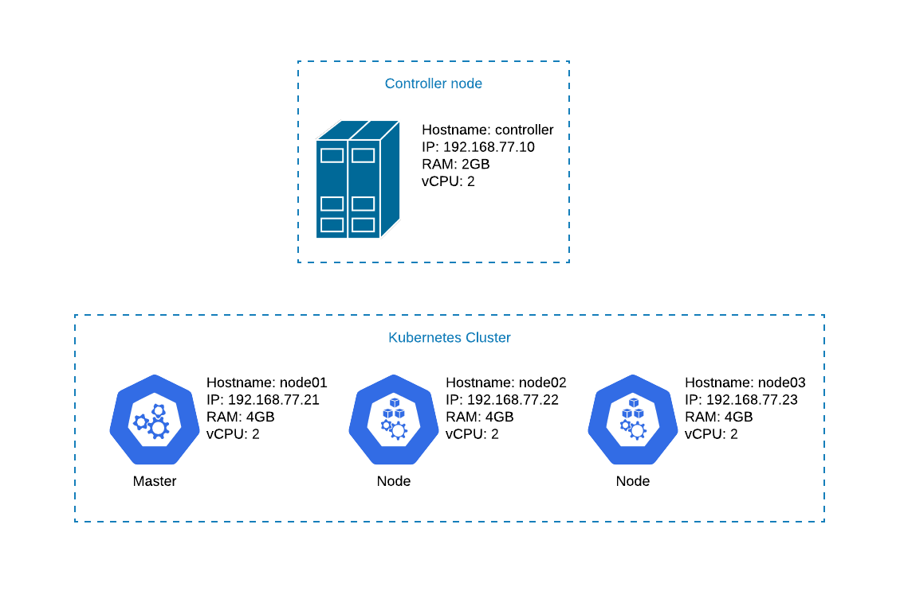

# Create Kubernetes Cluster using Kubespray

[![pre-commit badge][pre-commit-badge]][pre-commit] [![Conventional commits badge][conventional-commits-badge]][conventional-commits] [![Keep a Changelog v1.1.0 badge][keep-a-changelog-badge]][keep-a-changelog] [![MIT License Badge][license-badge]][license]

This repository will create a Kubernetes Cluster, using Kubespray,
so it can be used for a Lab Environment.

It will create 4 VMs:

- node0[1-3]: 1 k8s master and 2 worker nodes (2 vcpu and 4GB RAM each)
- controller: controller node (2 vcpu, 2GB RAM)

`kubectl` binary will be installed on the controller node.

This repository was tested using


## Quick Start



Check the variables defined on the `.env` file.

**NOTE:** The bootstrap uses the ```~/.ssh/id_rsa``` and ```~/.ssh/id_rsa.pub```,
so if you don't have these files, you need to create using:

```bash
ssh-keygen -t rsa
```

To create the k8s cluster just run:

```bash
vagrant up
vagrant provision --provision-with k8s
```

You can now connect to the controller node and use kubectl using:

```bash
vagrant ssh controller

kubectl cluster-info
```

## Documentation

- [Requirements](docs/requirements.md)
- [References](docs/references.md)

## Some notes

- This uses the following Vagrant plugins (automatically installed):
  - vagrant-hostmanager
  - vagrant-env
- You can change some variables for kubespray in the `.env` file (or using environment variables)

### Environment variables

The following environment variables can be used to overwrite values from `.env` file:

- KUBESPRAY_VER (defaults to 'v2.14.2')

## pre-commit hooks

Read the [pre-commit hooks](docs/pre-commit-hooks.md) document for more info.

## git-chglog

Read the [git-chglog](docs/git-chlog.md) document for more info.

[pre-commit]: https://github.com/pre-commit/pre-commit
[pre-commit-badge]: https://img.shields.io/badge/pre--commit-enabled-brightgreen?logo=pre-commit&logoColor=white
[conventional-commits-badge]: https://img.shields.io/badge/Conventional%20Commits-1.0.0-green.svg
[conventional-commits]: https://conventionalcommits.org
[keep-a-changelog-badge]: https://img.shields.io/badge/changelog-Keep%20a%20Changelog%20v1.1.0-%23E05735
[keep-a-changelog]: https://keepachangelog.com/en/1.0.0/
[license]: ./LICENSE
[license-badge]: https://img.shields.io/badge/license-MIT-green.svg
[changelog]: ./CHANGELOG.md
[changelog-badge]: https://img.shields.io/badge/changelog-Keep%20a%20Changelog%20v1.1.0-%23E05735
